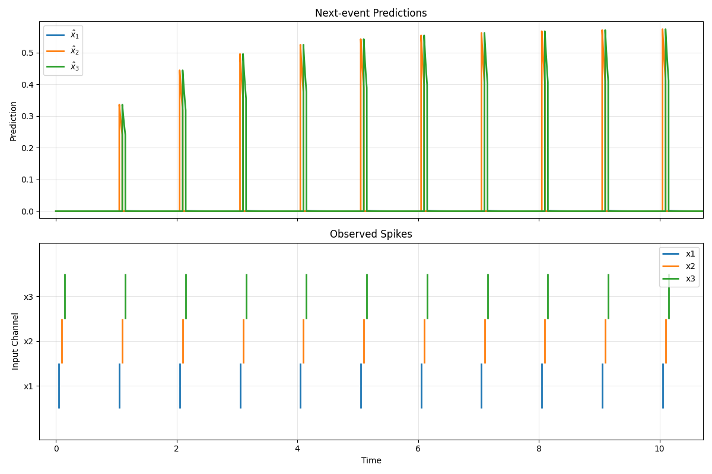
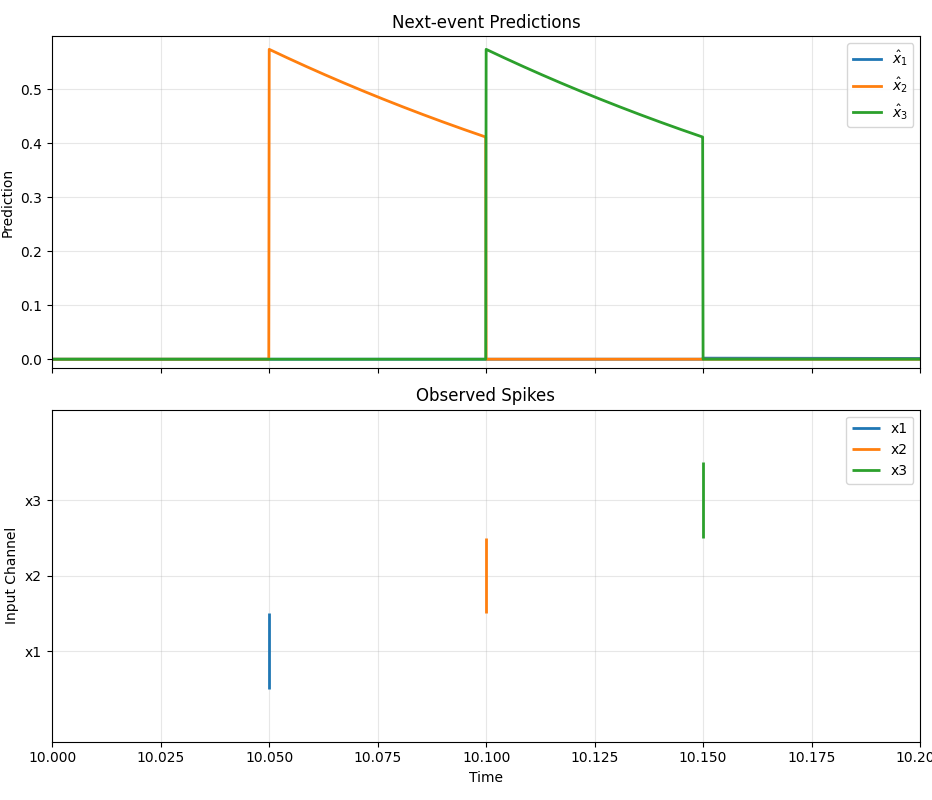
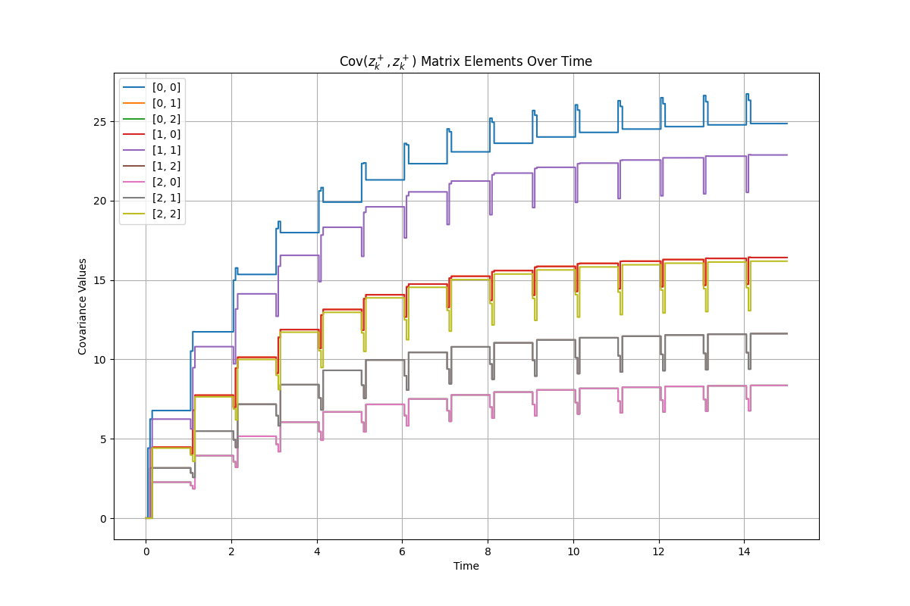
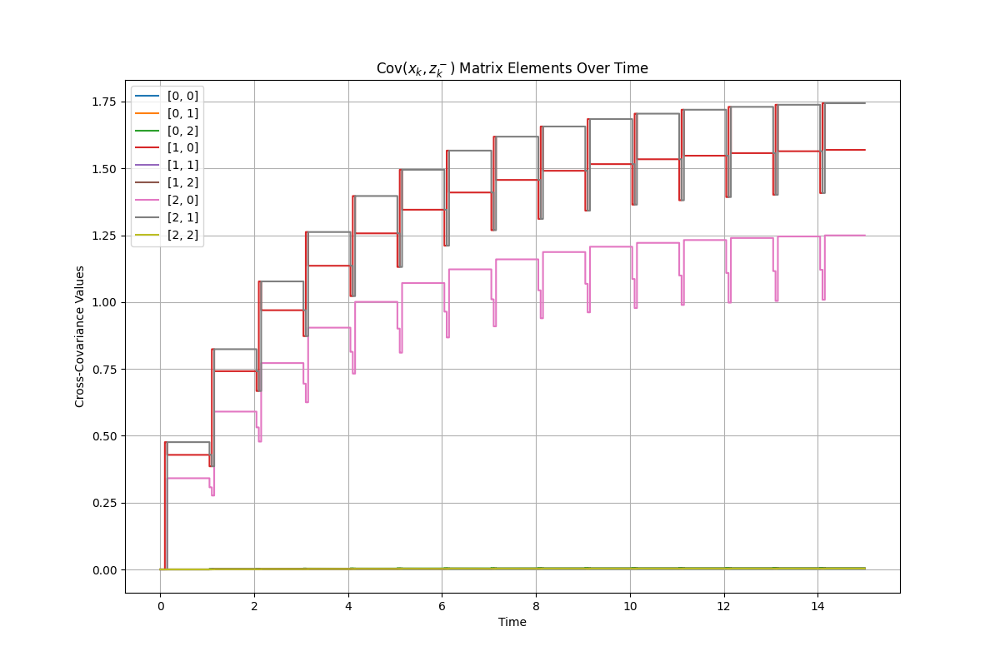

# Event-Based Data-Driven Prediction of Spiking Activity
This repository contains an implementation of an event-based data-driven predictor for neural spiking activity. Through event-based running covariance estimates, the model learns causal relationships between input spike trains and predicts future spike events.

The motivation for event-based modelling of causal relationships between spike trains is inspired by the idea of modelling the neuron as a data-driven controller, as presented in [The Neuron as a Direct Data-Driven Controller](https://www.pnas.org/doi/10.1073/pnas.2311893121). In exploring this idea, my previous project demonstrated the implementation of [Spiking Neurons as Data-Driven Controllers of LTI Systems](https://github.com/fredrikmagnus/SpikingDataDrivenController). In that implementation, the neuron relies on covariance-estimates for predicting the causal effect of firing a spike on the discrete-time behaviour of an LTI system. It does so based on an *internal state* consisting of an explicit memory of the plant output and spikes applied at the previous time-steps. 

Continuing in this direction towards spiking neural networks it becomes clear that the framework of continuous trajectories of LTI systems and operating on discrete time-steps is poorly suited. In a neural network, each neuron interacts mainly with other neurons. Hence the *external system*, as seen by an individual neuron, must be identified by its *trajectory* consisting of a sequence of spikes, discrete events, rather than a continous trajectory. And instead of operating on time-steps, it is tempting to exploit the sparse nature of spikes and operate directly on events.    

This repository represents preliminary investigation towards extending the data-driven framework to an event-based methodology. Adopting an event-based kernel for spike-trains (akin to in [Reproducing kernel Hilbert spaces for spike train analysis](https://www.researchgate.net/publication/220735994_Reproducing_kernel_Hilbert_spaces_for_spike_train_analysis)) covariance estimates updated only at spikes times can be used to predict causal relationships between spike-trains. The kernel is based on *exponential traces* to encode a fading memory of incoming spikes, representing post-synaptic potentials. This is implemented by filtering spikes with the first order low-pass filter with impulse response:

$h(t) = \frac{1}{\tau} e^{-t/\tau} u(t)$,

where $\tau$ is the time-constant of the filter and $u(t)$ is the unit step function. Considering $n$ spike trains we denote the spike times as $t_k, k=1,2,...$ and define $x_k := x(t_k) \in \left\lbrace 0,1 \right\rbrace^n$ as the binary vector signifying which neuron spiked at time $t_k$. Correspondingly we define $z_k := (h*x)(t_k)$ as the vector of exponential traces at time $t_k$, with $z_k^-$ and $z_k^+$ denoting the traces immediately before and after the spike event at time $t_k$. 

The predictor implemented here is expressed as:

$y(t) = Cov(x_k, z_k^-) Cov(z_k^+, z_k^+)^{-1} z(t)$,

where $y(t)$ is the output prediction at time $t$ given the current trace vector $z(t)$. The covariance estimates are updated at spike times according to:

$Cov(x_k, z_k^-) \leftarrow \gamma Cov(x_k, z_k^-) + (1-\gamma) x_k z_k^{-\top}$,

$Cov(z_k^+, z_k^+) \leftarrow \gamma Cov(z_k^+, z_k^+) + (1-\gamma) (z_k^+ z_k^{+\top} + \lambda I)$,

with $\gamma \in (0,1)$ being a forgetting factor, weighting recently observed events more heavily and allowing adaptation to non-stationary statistics. A small ridge-regularization term $\lambda I$ is necessary for numerical stability when inverting the covariance matrix. An interpretation of the output prediction comes from the fact that the trace vector decays passively between events. The passive decay property implies $z_{k+1}^- = \alpha_k z_k^+$, with $\alpha_k = e^{-(t_{k+1}-t_k)/\tau}$. Hence we can express the cross-covariance as

$Cov(x_k, z_k^-) = Cov(x_k, \alpha_{k-1} z_{k-1}^+) = Cov(\alpha_{k-1} x_k, z_{k-1}^+)$. 

Under a stationarity assumption we can shift the indices to obtain

$Cov(x_k, z_k^-) \approx Cov(\alpha_k x_{k+1}, z_k^+)$. 

This shows that the model estimates the optimal least-squares linear predictor of the (scaled) next event $\alpha_k x_{k+1}$ given the current trace vector $z_k^+$, assuming a zero-mean joint distribution:

$y(t_k) \approx Cov(\alpha_k x_{k+1}, z_k^+) Cov(z_k^+, z_k^+)^{-1} z_k^+$ = $E[\alpha_k x_{k+1} | z_k^+]$.

I.e. based on entirely local-in-time samples and event-based running covariance estimates, the model learns to predict over an entire time-horizon until the next event given a fading-memory internal state encoding past events.

## Experimental results
A simple example is used to demonstrate the capability of the event-based predictor to learn causal relationships between spike-trains. In this example, three input spike-trains are generated with a deterministic periodic pattern, with spikes occurring every second but with phases offset 50ms from each other. The kernel employs a time-constant of 150ms, giving an overlap between the exponential traces within a burst of spikes but a decay to near-zero between bursts. The forgetting factor is set to $\gamma = 0.9$ and ridge-regularization to $\lambda = 10^{-4}$. The time-step for updating the exponential traces is set to 1ms for plotting purposes, and a prediction is made at every time-step. It is, however, possible to jump directly between event times by decaying the exponential traces appropriately according to the time-difference between events.

The figure below shows the predictor learning to predict the next spike over a roughly 10 second simulation, with an adequate prediction after only seing the pattern once. The left plot shows the full prediction over time, with a raster of the input spikes below. The right plot gives a zoomed-in view. We see that the predictions for the second spike peaks after seeing the first spike, and similarly for the third spike after seeing the second spike. The first spike is not predicted due to the fading-memory traces decaying to near-zero before the first spike in the pattern occurs.

|  |  |
|:---:|:---:|

The temporal evolution of the elements in the cross-covariance matrix $Cov(x_k, z_k^-)$ and the covariance matrix $Cov(z_k^+, z_k^+)$ are shown below. The statistics are characterised by large updates at spike times and no change in inter-spike intervals. The values converge to a stationary value due to the forgetting factor $\gamma$, giving a weighted average dominated by recent events.

|  |  |
|:---:|:---:|

